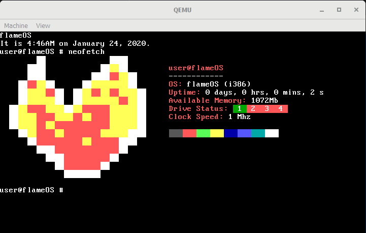

# flame



This project was originally based off the [os-tutorial](https://github.com/cfenollosa/os-tutorial) written by cfenollosa.

Resources from the [OSDev Wiki](https://wiki.osdev.org) have also been used.

## Building

Dependencies:
- `git` @ Stable
- `make` @ Stable
- `x86_64-elf-gcc` >= 8.0.0
- `binutils` @ Stable
- `xorriso` >= 1.2.9
- `nasm` @ Stable
`- qemu` @ Stable (>= 4.2.0 for MacOS 15)

## Running

```
qemu-system-x86_64 -serial stdio -soundhw pcspk -m 1G -device isa-debug-exit,iobase=0xf4,iosize=0x04 -boot menu=on -cdrom flame.iso -hda flamedisk.img
```

## Filesystem Structure

`cpu`: code that interacts with the cpu (ISRs, IRQs, Port I/O)

`drivers`: drivers

`fs`: HDD I/O and Filesystem

`kernel`: kernel code

`libc`: useful functions

## License

This project is licensed under the MIT License. You should have recieved a copy of it along with this software.